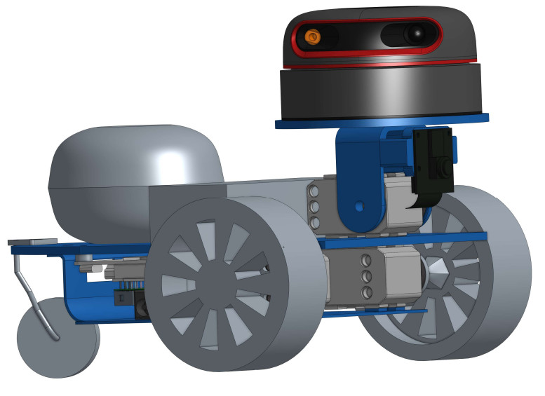

# Roboticia-drive
An vehicle with different sensor. A lidar (RPLidar A2) to scan the surrounding and to make SLAM. A voice recognition and synthesis to be understood by your robot with voice. A camera to improve the percetion of the environnement (colors, shape and face recognition).
It can be 3D printed and laser cutted. It works with Dynamixel XL-320 motors, and a Raspberry Pi for control.

The Roboticia-drive is ideal to make SLAM algorithm and advance environnement perception.

It is particularly well suited for educational purposes (cheap, simple to assemble, and easily controllable) or research task (easy to adapt accordingly to your specific purpose).

## Contributing

Roboticia-drive is maintened by Roboticia. You can share your experience, new design, ideas or questions on the [Poppy project forum](https://forum.poppy-project.org/).

To contribute to this repository, you can [fork it](https://help.github.com/articles/fork-a-repo/) and propose a [pull request](https://help.github.com/articles/using-pull-requests/) *([Another useful link](https://gun.io/blog/how-to-github-fork-branch-and-pull-request/))*

## License

|   License     |     Hardware    |   Software      |
| ------------- | :-------------: | :-------------: |
| Title  | [Creative Commons BY-SA](http://creativecommons.org/licenses/by-sa/4.0/)  |[GPL v3](http://www.gnu.org/licenses/gpl.html)  |
| Logo  |   |  |

## More on the project

- [Website](http://www.roboticia.com)
- [Facebook](https://www.facebook.com/roboticia)
- [Forum](https://forum.poppy-project.org)
- [Vimeo](https://vimeo.com/roboticia)
